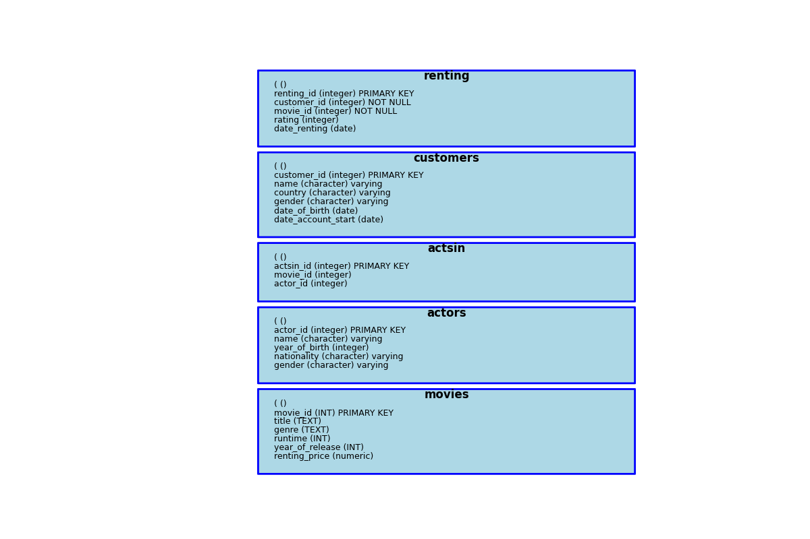

```{r setup, include=FALSE}
knitr::opts_chunk$set(echo = TRUE)
library(RSQLite)
source("utils.R")
library(dplyr)
library(plotly)
```

```{r}
execute_query("SELECT * FROM actors LIMIT 10;")
```


# Exploration de la structure d'une base de données

## Diagramme Entité-Relation

Le diagramme entité-relation (ERD - Entity-Relationship Diagram) est un outil de modélisation utilisé pour représenter les données et leurs relations dans un système d'information. Il est couramment utilisé dans la conception de bases de données pour structurer et organiser les données de manière logique. Voici les éléments clés d'un diagramme entité-relation :

### Éléments Clés du Diagramme Entité-Relation

1.  **Entités** :
    -   **Définition** : Les entités représentent des objets ou des concepts importants pour le système. Ce sont des "choses" ayant une existence indépendante, qui peuvent être des personnes, des objets, des événements, etc.
    -   **Représentation** : Les entités sont généralement représentées par des rectangles.
    -   **Exemples** : `Client`, `Film`, `Commande`.
2.  **Attributs** :
    -   **Définition** : Les attributs décrivent les propriétés ou les caractéristiques des entités. Chaque entité peut avoir plusieurs attributs.
    -   **Représentation** : Les attributs sont représentés par des ovales connectés aux entités.
    -   **Exemples** : Pour l'entité `Client`, les attributs peuvent être `Nom`, `Adresse`, `Email`.
3.  **Relations** :
    -   **Définition** : Les relations définissent comment les entités sont liées entre elles. Elles décrivent les interactions entre les entités.
    -   **Représentation** : Les relations sont représentées par des losanges connectés aux entités concernées.
    -   **Exemples** : Une relation entre `Client` et `Commande` pourrait être `Passe`.
4.  **Cardinalités** :
    -   **Définition** : Les cardinalités spécifient le nombre d'occurrences d'une entité qui peuvent être associées à une occurrence d'une autre entité dans une relation.
    -   **Représentation** : Les cardinalités sont généralement notées sur les lignes reliant les entités aux relations, comme 1:1, 1:N, ou N:M.
    -   **Exemples** : Un `Client` peut passer plusieurs `Commandes` (1:N), mais chaque `Commande` est passée par un seul `Client` (N:1).

### Exemple de Diagramme Entité-Relation

Imaginons une base de données pour une société de location de films. Voici un exemple simple de diagramme entité-relation pour ce système :

-   **Entités** :
    -   `Client`
    -   `Film`
    -   `Commande`
-   **Attributs** :
    -   `Client` : `Client_ID`, `Nom`, `Prénom`, `Date_de_Naissance`
    -   `Film` : `Film_ID`, `Titre`, `Genre`, `Année`
    -   `Commande` : `Commande_ID`, `Date_Commande`, `Client_ID`, `Film_ID`
-   **Relations** :
    -   `Client` passe `Commande`
    -   `Film` est inclus dans `Commande`
-   **Cardinalités** :
    -   Un `Client` peut passer plusieurs `Commandes` (1:N)
    -   Un `Film` peut être inclus dans plusieurs `Commandes` (N:M)

### Représentation Graphique

```         
[Client]---(passe)--<[Commande]>--(inclut)>---[Film]
 |                  |                         |
+-----------+    +----------+             +--------+
|Client_ID  |    |Commande_ID|             |Film_ID |
|Nom        |    |Date      |             |Titre    |
|Prénom     |    |Client_ID |             |Genre    |
|Date_Naiss |    |Film_ID   |             |Année    |
+-----------+    +----------+             +--------+
```

### Utilisation

-   **Conception de Bases de Données** : L'ERD est utilisé pour planifier et structurer la base de données avant sa mise en œuvre.
-   **Communication** : Il facilite la communication entre les développeurs, les analystes de données et les parties prenantes non techniques.
-   **Documentation** : Il sert de documentation pour le système de base de données.

En résumé, le diagramme entité-relation est un outil visuel essentiel pour la modélisation des données, permettant de représenter de manière claire et structurée les entités, leurs attributs, et les relations qui les lient au sein d'un système d'information.

## Structure des Données de MovieNow

Voici un aperçu des tables de la base de données :

-   **Table 'customers'** : Contient les colonnes 'customer_id' (identifiant unique pour chaque client), nom, pays, sexe, date de naissance et date de création du compte MovieNow.

-   **Table 'movies'** : Inclut les colonnes 'movie_id' (identifiant unique pour chaque film), titre du film, genre du film, durée, année de sortie et coût de la location.

-   **Table 'renting'** : Enregistre toutes les locations de films. Les colonnes incluent 'renting_id' (identifiant unique pour chaque location), 'customer_id' (indique quel client a loué le film), 'movie_id' (indique quel film a été loué), 'rating' (évaluation du film par le client, de 1 à 10) et date de location.

-   **Table 'actors'** : Contient des informations sur les acteurs dans les films. Les colonnes incluent 'actor_id' (identifiant unique pour chaque acteur), nom, année de naissance, nationalité et sexe.

-   **Table 'actsin'** : Montre quels acteurs apparaissent dans quels films. Les colonnes incluent 'actsin_id' (identifiant unique), 'movie_id' et 'actor_id'.

Voici un résumé des tables et de leurs attributs dans la base de données selon le fichier SQL fourni :



1. **Table `movies`**:
   - `movie_id` (INT, PRIMARY KEY)
   - `title` (TEXT)
   - `genre` (TEXT)
   - `runtime` (INT)
   - `year_of_release` (INT)
   - `renting_price` (numeric)

2. **Table `actors`**:
   - `actor_id` (integer, PRIMARY KEY)
   - `name` (character varying)
   - `year_of_birth` (integer)
   - `nationality` (character varying)
   - `gender` (character varying)

3. **Table `actsin`**:
   - `actsin_id` (integer, PRIMARY KEY)
   - `movie_id` (integer)
   - `actor_id` (integer)

4. **Table `customers`**:
   - `customer_id` (integer, PRIMARY KEY)
   - `name` (character varying)
   - `country` (character varying)
   - `gender` (character varying)
   - `date_of_birth` (date)
   - `date_account_start` (date)

5. **Table `renting`**:
   - `renting_id` (integer, PRIMARY KEY)
   - `customer_id` (integer, NOT NULL)
   - `movie_id` (integer, NOT NULL)
   - `rating` (integer)
   - `date_renting` (date)


Une fois que vous connaissez les noms des tables de la base de données, une manière d'avoir une idée de ce qu'il y a dans un tableau consiste simplement à en sélectionner quelques lignes

```{r}
# Apercu de la table movies
execute_query("SELECT * FROM movies LIMIT 5;")
```

On peut automatiser cette tâche avec du code R :

```{r}
tables_vect <- c("actors", "actsin", "customers", "movies", "renting")
```


```{r}
# Afficher un aperçu des tables

for (table in tables_vect) {
  query <- paste("SELECT * FROM", table, "LIMIT 5;")
  result <- execute_query(query)
  cat("\nAperçu de la table:", table, "\n")
  print(result)
}
```

Il est également possible de ne sélectionner que quelques colonnes d'une table :

```{r}
query <- "SELECT movie_id,
                 rating
         FROM renting
         LIMIT 5;"
execute_query(query)
```

## Dimension d'une table

Connaitre la dimension de chaque table (nombre de lignes et nombre de colonnes) est une étape cruciale dans l'exploration de votre base de données.

```{r}
# Afficher le nombre total de lignes dans chaque table

for (table in tables_vect) {
  query <- paste("SELECT COUNT(*) FROM", table, ";")
  result <- execute_query(query)
  cat("\nNombre total de lignes dans la table:", table, "\n")
  print(result)
}
```

COUNT(\*) : Nombre total de lignes

COUNT(column_name) compte le nombre d'observations non NULL dans la colonne column_name (Nombre total de lignes - nombre de valeurs NULL)

```{r}
# Nombre de valeurs non NULL dans la colonne rating de la table renting
query <- "SELECT COUNT(rating) from renting;"
execute_query(query)
```

```{r}
# Nombre de valeurs NULL dans la colonne rating de la table renting
query <- "SELECT COUNT(*) - COUNT(rating) AS missing_rating
          FROM renting;"
execute_query(query)
```

SELECT DISTINCT column_name : va sélectionner directement les valeurs distinctes d'une colonne et NULL sera incluse en tant que valeur distincte si elle existe dans la colonne même si elle n'est pas comptée par la fonction COUNT

```{r}
query <- "SELECT DISTINCT rating FROM renting;"
execute_query(query)
```

COUNT(DISTINCT column_name) : Nombre de valeurs distinctes non NULL dans la colonne

```{r}
query <- "SELECT COUNT(DISTINCT rating) FROM renting;"
execute_query(query)
```

# Filtrage et Tri des Données SQL

Filtrer les enregistrements pertinents pour une question de recherche particulière et organiser les tables dans un ordre spécifique est essentiel pour les futures applications.

## Clause WHERE

L'ajout d'une clause WHERE à une instruction SQL permet de sélectionner certaines lignes d'une table en fonction d'une condition. Par exemple, pour sélectionner tous les clients venant d'Italie, on utilise `WHERE country = 'Italy'`.

```{r}
query <- "SELECT * FROM customers
          WHERE country = 'Italy';"
execute_query(query)
```

```{r}
# Tous les films loués le 9 Octobre 2018
query <- "SELECT *
          FROM renting
          WHERE date_renting = '2018-10-09';"
execute_query(query)
```

### Opérateurs dans la Clause WHERE

Divers opérateurs peuvent être utilisés dans la clause WHERE, notamment :

-   Les opérateurs de comparaison (pour vérifier l'égalité, la différence, ou la supériorité/infériorité des valeurs).

-   L'opérateur BETWEEN pour une plage de valeurs.

-   L'opérateur IN pour comparer des valeurs multiples.

-   L'opérateur NULL pour traiter les valeurs manquantes ou inconnues.

#### Exemples d'Opérateurs de Comparaison

1.  Sélectionner tous les films dont le genre n'est pas 'Drama'.

2.  Sélectionner les films avec un prix de location supérieur ou égal à 2.

```{r}
# tous les films dont le genre n'est pas 'Drama'
execute_query("SELECT DISTINCT(genre) FROM movies") # Pour connaître les modalités de la colonne genre
execute_query("SELECT * FROM movies WHERE genre != 'Drama';") # WHERE genre <> 'Drama' 

# Sélectionner les films avec un prix de location supérieur ou égal à 2.
execute_query("SELECT 
                    title, 
                    renting_price 
              FROM movies 
              WHERE renting_price >= 2;")
```

#### Exemple de l'Opérateur BETWEEN

Sélectionner les clients ayant créé leur compte entre janvier et septembre 2018, en incluant les dates de début et de fin. Les dates doivent être entourées de guillemets simples dans SQL.

```{r}
query <- "SELECT * 
          FROM customers 
          WHERE date_account_start BETWEEN '2018-01-01' AND '2018-09-30';
"
execute_query(query)
```

```{r}
# Sélectionnez tous les enregistrements de locations de films entre début avril 2018 et fin août 2018.
query <- "SELECT *
          FROM renting
          WHERE date_renting BETWEEN '2018-04-01' AND '2018-08-31';"
execute_query(query)
```

#### Exemple de l'Opérateur IN

Comparer la nationalité des acteurs pour sélectionner ceux des États-Unis ou d'Australie.

```{r}
execute_query("SELECT DISTINCT(nationality) FROM actors;")

execute_query(("SELECT * FROM actors 
                WHERE nationality IN ('USA', 'Australia');"))
```

```{r}
# Sélectionner les films : 'Showtime', 'Love Actually', et 'The Fighter'
query <- "SELECT *
          FROM movies
          WHERE title IN ('Showtime', 'Love Actually', 'The Fighter');"
execute_query(query)
```

#### Exemple de l'Opérateur NULL

Sélectionner les enregistrements où la valeur de la colonne "rating" est NULL (absence de note) ou non NULL (présence de note).

```{r}
# Sélectionner les enregistrements où la valeur de "rating" est NULL
query = "SELECT *
        FROM renting
        WHERE rating IS NULL;"
execute_query(query)

# Sélectionner les enregistrements où la valeur de "rating" est non NULL
query = "SELECT *
        FROM renting
        WHERE rating IS NOT NULL;"
execute_query(query)
```

### Opérateurs Booléens

-   **AND** : Connecter deux ou plusieurs conditions. Exemple : Clients d'Italie ayant créé leur compte entre janvier et septembre 2018.

```{r}
query = "SELECT * FROM
         customers
         WHERE country = 'Italy'
         AND date_account_start BETWEEN '2018-01-01' AND '2018-09-30;'"
execute_query(query)
```

-   **OR** : Connecter des conditions alternatives. Exemple : Clients d'Italie ou ayant créé leur compte entre janvier et septembre 2018.

```{r}
query = "SELECT * FROM
         customers
         WHERE country = 'Italy'
         OR date_account_start BETWEEN '2018-01-01' AND '2018-09-30;'"
execute_query(query)
```

## Clause ORDER BY

Utiliser ORDER BY pour trier les résultats d'une requête par les valeurs d'une ou plusieurs colonnes. Par défaut, l'ordre est ascendant.

```{r}
# Classement des films du prix de location le moins cher au plus cher
execute_query("SELECT *
              FROM movies
              ORDER BY renting_price;")
```

```{r}
# Classement des films du prix de location le plus cher au moins cher
execute_query("SELECT *
              FROM movies
              ORDER BY renting_price DESC;")
```

```{r}
# Quels sont les films dont le prix de location est supérieur ou égal à 2 u.m (unités monétaires) ?
execute_query("SELECT 
                    title, 
                    renting_price 
              FROM movies 
              WHERE renting_price >= 2 
              ORDER BY renting_price;")
```

# Agrégations - Résumer les Données

Pour la prise de décision, il est généralement plus important d'examiner les résumés de certains groupes plutôt que les enregistrements individuels. Par exemple, il est plus utile de regarder la note moyenne ou de compter le nombre de vues d'un film plutôt que de considérer chaque note et chaque location de film séparément.

```{r}
query = "SELECT AVG(renting_price) FROM movies;"
execute_query(query)
```

Dans cette requête, la colonne `renting_price` de la table `movies` est agrégée en utilisant la fonction `AVG` (moyenne), nous obtenons ainsi le prix moyen de location d'un film.

## Autres Fonctions d'Agrégation

Voici une liste d'autres fonctions d'agrégation qui seront utilisées dans ce cours : `SUM`, `COUNT`, `MIN`, et `MAX`.

```{r}
execute_query("SELECT COUNT(*) FROM actors;")

execute_query("SELECT COUNT(name) FROM actors;")

execute_query("SELECT COUNT(year_of_birth) FROM actors;")
```

La requête `SELECT COUNT(*) FROM actors` compte le nombre de lignes de la table `actors`, le résultat est 145. Appliquer la fonction `COUNT()` à une colonne renvoie le nombre de valeurs non NULL dans cette colonne. Nous obtenons donc le même résultat en comptant le nombre d'entrées dans la colonne `name`, car il n'y a pas de valeurs NULL dans cette colonne. La colonne `year_of_birth` a deux valeurs NULL, c'est pourquoi la troisième requête renvoie 143 au lieu de 145. Les fonctions d'agrégation `AVG`, `SUM`, `MIN`, et `MAX` ignorent toujours les valeurs NULL.

```{r}
# Stats descriptives sur le film avec l'identifiant 25
query <- "SELECT 
              MIN(rating) AS min_rating, 
          		MAX(rating) AS max_rating, 
          		AVG(rating) AS avg_rating,
          		COUNT(rating) AS number_ratings
          FROM renting
          WHERE movie_id = 25;"
execute_query(query)
```

## DISTINCT

Le mot-clé `DISTINCT` est très utile pour filtrer les doublons et ne regarder que les valeurs uniques. Par exemple, pour sélectionner les pays distincts de la table `customer`, montrant tous les pays d'origine des clients. Ensuite, nous pouvons compter les pays distincts, ce qui nous donne le résultat 11.

```{r}
execute_query("SELECT DISTINCT country FROM customers;")

execute_query("SELECT COUNT(DISTINCT country) FROM customers;")
```

```{r}
execute_query("SELECT DISTINCT rating FROM renting ORDER BY rating;")
```

Dans cette requête, la colonne `rating` de la table `renting` a des valeurs de 1 à 10 ou NULL. `DISTINCT rating` liste toutes ces valeurs, y compris NULL. La dernière ligne de la requête ordonne la table résultante par les valeurs de `rating`. L'ordre est ascendant et NULL est à la position finale, ce qui signifie que NULL est traité comme la plus grande valeur lors de l'ordre.

## Donner un Alias aux Noms de Colonnes

```{r}
query = "
SELECT AVG(renting_price) AS average_price,
      COUNT(DISTINCT genre) AS number_genres
FROM movies;
"
execute_query(query)
```

Dans la clause `SELECT`, le terme `AS` peut être ajouté pour définir des noms de colonnes dans la table de retour. Ces nouveaux noms de colonnes sont également appelés alias ou noms abrégés. Utiliser des alias rend la table résultante plus explicite. Par exemple, nous avons le prix moyen et le nombre de genres avec des noms de colonnes plus explicites.

# Regroupement de films

Cette leçon se concentre sur l'utilisation de la clause GROUP BY dans les requêtes SQL. La clause GROUP BY permet d'appliquer des agrégations à des groupes spécifiques au sein d'une table.

## Applications de GROUP BY

Pour évaluer le succès et le potentiel d'une entreprise, il est souvent utile d'analyser des groupes de clients ou de produits ensemble. Par exemple, on peut regrouper les clients par pays ou sexe, ou les films par genre ou année de sortie. Un exemple est donné pour calculer le prix moyen de location par genre de film.

```{r}
query = "
SELECT genre, 
       AVG(renting_price) AS avg_renting_price
FROM movies
GROUP BY genre
ORDER BY avg_renting_price DESC;
"
execute_query(query)
```

La requête peut être étendue pour inclure le nombre de films dans chaque catégorie en utilisant COUNT. Cela permet de compter les films par genre.

```{r}
query = "
SELECT genre, 
       AVG(renting_price) avg_renting_price,
       COUNT(*) number_movies
FROM movies
GROUP BY genre
ORDER BY avg_renting_price DESC;
"
execute_query(query)
```

```{r}
# Réalisez une analyse pour voir quand les premiers comptes clients ont été créés pour chaque pays.
query <- "
SELECT 
  country,
	MIN(date_account_start) AS first_account
FROM customers
GROUP BY country
ORDER BY first_account;
"
execute_query(query)
```

Pour chaque film, on veut connaitre sa note moyenne, le nombre de notes et le nombre de locations

```{r}
query <- "
SELECT movie_id, 
       AVG(rating) AS avg_rating,
       COUNT(rating) AS number_ratings,
       COUNT(*) AS number_renting
FROM renting
GROUP BY movie_id
ORDER BY avg_rating DESC;
"
execute_query(query)
```

## Clause HAVING

La clause HAVING peut être ajoutée à une requête GROUP BY pour filtrer les groupes qui satisfont certaines conditions, en utilisant des fonctions d'agrégation comme somme, moyenne ou compte.

Par exemple : Quels sont les genres de films ayant plus de 6 films et quelle est la moyenne des prix de location pour chaque genre, triée par ordre décroissant de la moyenne des prix de location ?

```{r}
query = "
SELECT genre, 
       AVG(renting_price) avg_renting_price,
       COUNT(*) number_movies
FROM movies
GROUP BY genre
HAVING COUNT(*) > 6
ORDER BY avg_renting_price DESC;
"
execute_query(query)
```

# Les Jointures

Jusqu'à présent, nous avons discuté des requêtes SQL simples impliquant la récupération de données d'une seule table. Les requêtes de jointure permettent de combiner les données de plusieurs tables.

Pour joindre les tables, vous devez trouver une colonne qu'elles ont en commun où les valeurs sont cohérentes dans les tables. N'oubliez pas : ce n'est pas parce que deux tables ont une colonne du même nom que ces colonnes contiennent nécessairement des données compatibles. Si vous trouvez plusieurs paires de colonnes avec des données similaires, vous devrez peut-être essayer de les joindre tour à tour pour voir si vous obtenez le même nombre de résultats.

## LEFT JOIN

La déclaration LEFT JOIN est l'une des OUTER JOINS et est utilisée pour compléter une table (celle de gauche) avec des informations provenant d'une deuxième table (celle de droite). Nous conservons toutes les lignes de la table de gauche et utilisons uniquement les lignes de la table de droite qui peuvent être mises en correspondance. Un identifiant est nécessaire pour définir quelles lignes des deux tables peuvent être appariées.

### Donner un Nom à une Table

Avant de commencer à joindre des tables, voyons comment utiliser un alias pour nommer une table. Cela sera nécessaire pour les requêtes de jointure.

```{r}
query = "
SELECT *
FROM customers AS c
WHERE c.customer_id = 2;
"
execute_query(query)
```

Dans cette requête simple, nous donnons à la table `customers` l'alias `c`. Le mot `AS` peut être omis, mais nous l'utiliserons toujours pour une meilleure lisibilité. Pour accéder aux colonnes de cette table, nous utilisons `c.nom_colonne`. Cela sera important lorsque nous aurons plusieurs tables avec les mêmes noms de colonnes.

### Exemple de LEFT JOIN

Nous avons deux tables à joindre : `renting` (table de gauche) et `customers` (table de droite). Nous voulons compléter la table de gauche avec les informations de la table de droite, ce qui signifie que nous voulons ajouter les informations des clients à chaque location de film enregistrée dans la table `renting_`. Pour ce faire, nous devons identifier quelles lignes de table appartiennent l'une à l'autre, ce qui peut être fait avec `customer_id`.

```{r}
query = "
SELECT * 
FROM renting AS r
LEFT JOIN customers AS c
ON r.customer_id = c.customer_id;
"
execute_query(query)
```

Nous sélectionnons d'abord toutes les colonnes de la table `renting` et donnons à la table le nom `r`. Ensuite, nous utilisons la clause `LEFT JOIN` avec la deuxième table `customers`, nommée `c`. Après le mot `ON`, nous devons spécifier la condition de jointure : lorsque `customer_id` dans la table de location correspond à `customer_id` dans la table des clients. Le résultat montre que les trois premières colonnes sont identiques à la table `renting_selected`, et des nouvelles colonnes sont ajoutées à partir de la table `customers`. Les correspondances entre `customer_id` sont illustrées, montrant comment les valeurs NULL apparaissent pour les clients non appariés.

### Autre Exemple de LEFT JOIN

La direction de MovieRental souhaite publier des indicateurs de performance clés (KPI) pour les performances de l'entreprise en 2018. Elle souhaite mesurer les succès financiers ainsi que l'engagement des utilisateurs. Les KPI importants sont donc les revenus provenant de la location de films, le nombre de locations de films et le nombre de clients actifs.

Quelles sont les recettes totales des locations de films, le nombre total de locations de films et le nombre distinct de clients ayant loué des films en 2018 ?

```{r}
query = "
SELECT 
	SUM(m.renting_price),  -- Calcule le total des recettes des locations de films en 2018
	COUNT(*),  -- Calcule le nombre total de locations de films en 2018
	COUNT(DISTINCT r.customer_id)  -- Calcule le nombre distinct de clients ayant loué des films en 2018
FROM renting AS r
LEFT JOIN movies AS m
ON r.movie_id = m.movie_id
-- Ne considère que les locations de films en 2018
WHERE date_renting BETWEEN '2018-01-01' AND '2018-12-31';
"
execute_query(query)
```

Vous avez calculé un chiffre d'affaires de 658,02 et constaté que le nombre de locations est de 298 et le nombre d'utilisateurs actifs de 93 en 2018.

```{r}
# Quels sont les titres des films et les noms des acteurs qui ont joué dans ces films ?
query <- "
SELECT a.name AS actor_name,
       m.title AS film_title
FROM actsin AS ai
LEFT JOIN movies AS m
ON m.movie_id = ai.movie_id
LEFT JOIN actors AS a
ON a.actor_id = ai.actor_id;
"
execute_query(query)
```

# Utilisation de sous-requêtes

Dans cette leçon, vous apprendrez à calculer combien chaque client a dépensé en locations chez MovieRental en utilisant des sous-requêtes.

## Requêtes SELECT successives - actrices

Avant de calculer les dépenses des clients, introduisons les requêtes SELECT successives avec un exemple plus simple. Nous avons une requête qui sélectionne toutes les actrices (appelée requête 1).

```{r}
query = "
SELECT * 
FROM actors
WHERE gender = 'female';
"
execute_query(query)
```

Ensuite, nous souhaitons analyser davantage cette table. Par exemple, nous pourrions vouloir regrouper cette table par nationalité et indiquer l'année de naissance de l'actrice la plus âgée et la plus jeune dans chaque pays. Pour ce faire, nous insérons la requête une dans la clause FROM d'une autre requête, en utilisant des parenthèses et en lui donnant un nom (par exemple, 'AS af'). Ensuite, nous construisons une autre requête SQL autour de cette table 'af'. La requête une est exécutée en premier, puis le reste de la requête est exécuté sur le résultat 'af'.

```{r}
query = "
SELECT af.nationality,
       MIN(af.year_of_birth),
       MAX(af.year_of_birth)
FROM
    (
    SELECT * 
    FROM actors
    WHERE gender = 'female'
    ) AS af
GROUP BY af.nationality;
"
execute_query(query)
```

Dans cette base de données :

1.  **USA \| 1945 \| 1993**
    -   **Actrice la plus âgée :** La plus âgée des actrices américaines est née en 1945.
    -   **Actrice la plus jeune :** La plus jeune des actrices américaines est née en 1993.
    -   Cela montre une large plage d'âges parmi les actrices américaines, suggérant une représentation variée d'âges dans cette nationalité.
2.  **Australia \| 1967 \| 1982**
    -   **Actrice la plus âgée :** La plus âgée des actrices australiennes est née en 1967.
    -   **Actrice la plus jeune :** La plus jeune des actrices australiennes est née en 1982.
    -   Cette plage d'années montre que les actrices australiennes présentes dans la base de données sont nées entre ces deux années, offrant une perspective sur les tranches d'âge des actrices de cette nationalité.

## Combien chaque client a-t-il dépensé ?

Pour savoir combien chaque client a dépensé en locations de films, la première étape consiste à joindre la table 'renting' et la table 'movies' sur 'movie_id', car nous devons ajouter le tarif de location de la table 'movies' à la table 'renting'. Nous sélectionnons uniquement les colonnes 'customer_id' et 'renting_price' de la table jointe.

```{r}
query = "
SELECT 
      r.customer_id,
      m.renting_price
FROM renting AS r
LEFT JOIN movies AS m
ON r.movie_id = m.movie_id;
"
execute_query(query)
```

Comme dans l'exemple précédent, nous mettons la première requête entre parenthèses dans la clause FROM et lui donnons le nom 'rm'. Nous groupons la table 'rm' par 'customer_id' et sélectionnons 'customer_id' et la somme de 'renting_price'.

```{r}
query = "
SELECT
      rm.customer_id,
      SUM(rm.renting_price)
FROM
      (
      SELECT 
      r.customer_id,
      m.renting_price
      FROM renting AS r
      LEFT JOIN movies AS m
      ON r.movie_id = m.movie_id
      ) AS rm
GROUP BY rm.customer_id;
"
execute_query(query)
```

Cela nous donne une table avec 'customer_id' et la somme de tous les revenus des locations de films, nous indiquant combien chaque client a dépensé en locations chez MovieRental.

```{r}
execute_query(
  "SELECT
      rm.customer_id,
      SUM(rm.renting_price)
    FROM
      (
      SELECT 
      r.customer_id,
      m.renting_price
      FROM renting AS r
      LEFT JOIN movies AS m
      ON r.movie_id = m.movie_id
      ) AS rm
    GROUP BY rm.customer_id;"
)
```


```{r}
query = "
SELECT 
      c.customer_id,
      c.name,
      c.country,
      c.gender,
      c.date_of_birth,
      c.date_account_start,
      sq.total_spent
FROM
    (
    SELECT
      rm.customer_id,
      SUM(rm.renting_price) AS total_spent
    FROM
      (
      SELECT 
      r.customer_id,
      m.renting_price
      FROM renting AS r
      LEFT JOIN movies AS m
      ON r.movie_id = m.movie_id
      ) AS rm
    GROUP BY rm.customer_id
    ) AS sq
LEFT JOIN customers AS c
ON c.customer_id = sq.customer_id
ORDER BY sq.total_spent DESC;
"
df1 <- execute_query(query)
df1
```

Une manière "plus simple" et plus concise d'obtenir le même résultat :

```{r}
query = "
SELECT 
    c.customer_id,
    c.name,
    c.country,
    c.gender,
    c.date_of_birth,
    c.date_account_start,
    SUM(m.renting_price) AS total_spent
FROM customers AS c
LEFT JOIN renting AS r
ON c.customer_id = r.customer_id
LEFT JOIN movies AS m
ON r.movie_id = m.movie_id
GROUP BY c.customer_id, c.name, c.country, c.gender, c.date_of_birth, c.date_account_start
HAVING SUM(m.renting_price) IS NOT NULL
ORDER BY total_spent DESC;
"
df2 <- execute_query(query)
df2
```

```{r}
# Comparer df1 et df2 pour identifier les lignes présentes dans df1 mais pas dans df2
missing_rows <- df1 %>%
  anti_join(df2, by = "customer_id")

# Afficher les lignes manquantes
missing_rows
```

Le résultat que vous avez obtenu de `missing_rows` indique qu'il y a une ligne dans `df1` avec toutes les valeurs manquantes (`NA`) sauf pour `total_spent` qui est égal à `10.85`. Voici une explication de ce résultat :

1.  **Ligne avec `NA` pour la plupart des colonnes** :
    -   **customer_id, name, country, gender, date_of_birth, date_account_start** : Toutes ces colonnes ont des valeurs `NA`, ce qui signifie que pour cette ligne spécifique, ces valeurs n'existent pas dans `df1`.
2.  **`total_spent` = 10.85** :
    -   Cela indique que cette ligne a une valeur de `total_spent` de `10.85` mais n'a aucune autre information.

Explication détaillée - **Données manquantes (`NA`)** : - Les valeurs `NA` peuvent apparaître si cette ligne dans `df1` n'a pas de correspondance pour les colonnes mentionnées. Cela peut se produire si, lors de l'agrégation des données ou de la jointure initiale, il y avait une ligne où `total_spent` a été calculé mais les autres informations du client n'étaient pas présentes ou ont été perdues.

-   **Valeur de `total_spent`** :
    -   La présence de `total_spent` avec une valeur de `10.85` suggère qu'il y a eu une transaction enregistrée pour un client, mais les informations détaillées sur ce client étaient manquantes dans les données d'origine.

Raisons possibles pour ce résultat 1. **Incohérences dans les données sources** : - Il pourrait y avoir des incohérences ou des données manquantes dans la table d'origine (`customers` ou `renting`) qui ont conduit à la création de cette ligne lors des jointures ou des agrégations.

2.  **Problème de jointure** :
    -   Lors de l'utilisation de `LEFT JOIN`, il est possible que certaines lignes n'aient pas trouvé de correspondance dans la table `customers`, ce qui peut entraîner des valeurs `NA` pour ces colonnes, mais encore une valeur calculée pour `total_spent`.

Vérification des données sources Pour comprendre et corriger cette situation, vous pouvez vérifier les données sources et les étapes de transformation pour voir pourquoi les informations sur ce client sont manquantes mais une transaction a été enregistrée. Une vérification manuelle ou une exploration plus approfondie des données d'origine peut être nécessaire.

Si vous avez besoin d'aide pour cette étape, n'hésitez pas à fournir plus de détails sur les données sources ou les étapes de transformation que vous avez suivies.
